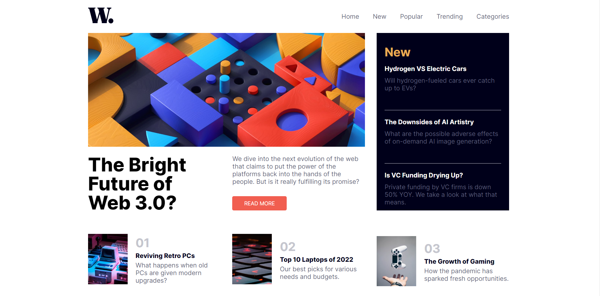

# Frontend Mentor - News homepage solution

This is a solution to the [News homepage challenge on Frontend Mentor](https://www.frontendmentor.io/challenges/news-homepage-H6SWTa1MFl).

## Overview

### The challenge

Users should be able to:

- View the optimal layout for the interface depending on their device's screen size
- See hover and focus states for all interactive elements on the page
- **Bonus**: Toggle the mobile menu (requires some JavaScript)

### Screenshot

### Links

- Solution URL:(https://github.com/cazanca/tip-calculator-vue)
- Live Site URL: (https://tip-calculator-b2ei9kgp0-cazanca.vercel.app/)

### Built with

- Semantic HTML5 markup
- CSS custom properties
- Flex box
- CSS Grid
- Javascript

## Author

- Frontend Mentor - [@cazanca](https://www.frontendmentor.io/profile/cazanca)